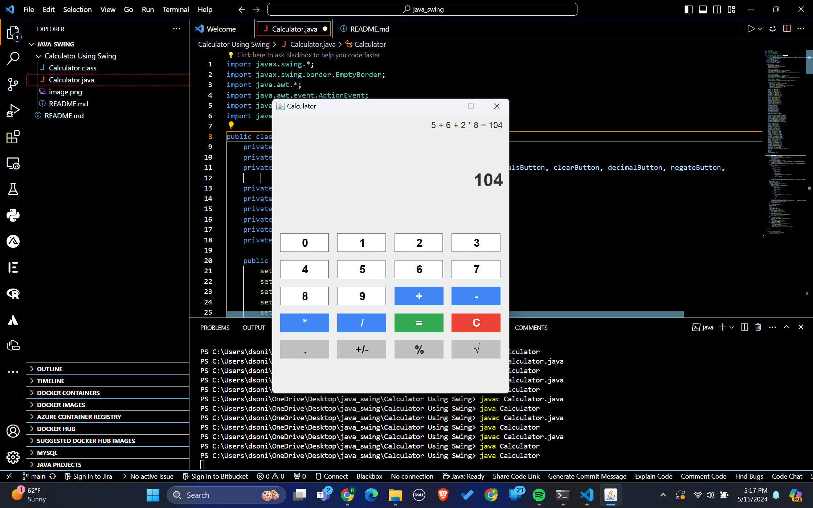
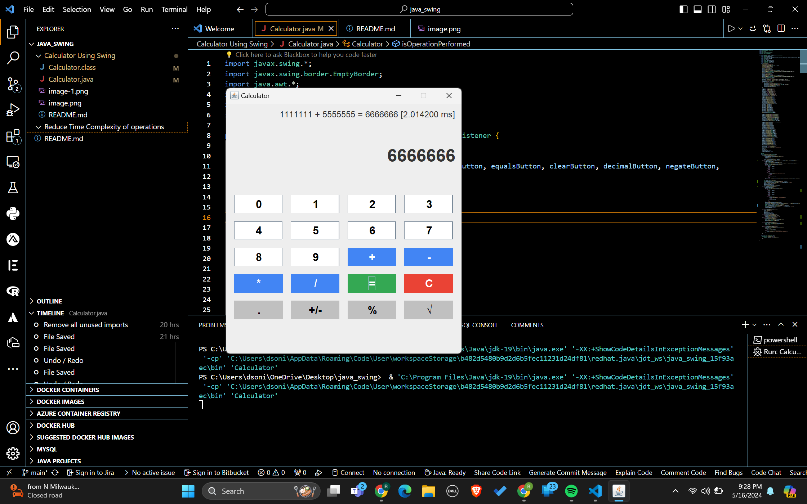

***Multiple Operands functionality***

***Time estimation of addition operation***

1. The Calculator class is created, extending JFrame and implementing ActionListener.

2. The constructor initializes the GUI components, including the display, history, number buttons, and operation buttons.

3. The GUI components are configured with appropriate properties such as font, color, size, and layout.

4. The ActionListener is set for each button to handle user interactions.

5. When a number button is clicked, the corresponding digit is appended to the display text field.

6. When an operation button (+, -, *, /) is clicked, the current result is updated based on the previous operand and operator, and the history is updated accordingly.

7. When the equals button (=) is clicked, the final result is calculated based on the current operand and operator, and the history is updated with the complete equation.

8. If the clear button (C) is clicked, the display and history are cleared, and all variables are reset.

9. If the decimal button (.) is clicked, a decimal point is appended to the display text if it doesn't already contain one.

10. If the negate button (+/-), percent button (%), or square root button (√) is clicked, the corresponding operation is performed on the current value in the display.

11. The main method is defined, which creates an instance of the Calculator class and makes it visible on the screen using SwingUtilities.invokeLater().